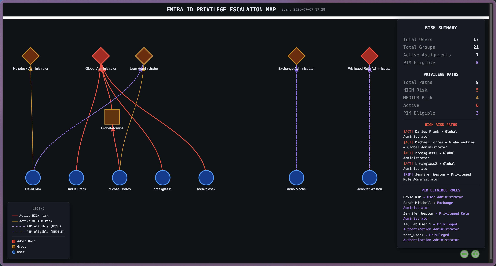

# Entra ID Attack Path Visualizer

Scans a Microsoft Entra ID tenant via Microsoft Graph API, detects privilege escalation paths through direct role assignments, group memberships, and PIM eligible roles, then generates an interactive HTML graph showing every path to administrative access.



## The Problem

Organizations lose track of who has administrative privileges in Entra ID:

- **Shadow admins**: users inherit admin access through nested group memberships without anyone realizing it
- **PIM blind spots**: users with eligible (not yet activated) roles don't show up in standard directory role queries, but they can activate to admin at any time
- **Role sprawl**: multiple users and groups assigned to privileged roles unnecessarily
- **Manual reviews miss indirect paths**: a user in a group that's assigned Global Administrator is a Global Administrator, but that doesn't show up when you look at the user's direct role assignments

Manual review of hundreds of users and groups takes 40+ hours per quarter. This tool automates it in under 5 minutes.

## What It Detects

- **Direct role assignments**: User &rarr; Admin Role
- **Group-based escalation paths**: User &rarr; Group &rarr; Admin Role
- **PIM eligible assignments**: users who can activate to admin roles on demand (queried via REST against the `roleEligibilitySchedules` endpoint since the Graph SDK doesn't handle this well)
- **Risk classification**: HIGH risk (Global Admin, Privileged Role Admin, Application Admin, Cloud App Admin, Authentication Admin) vs MEDIUM risk (User Admin, Helpdesk Admin, Exchange Admin, etc.)

### Privileged Roles Scanned

Global Administrator, Privileged Role Administrator, User Administrator, Security Administrator, Exchange Administrator, SharePoint Administrator, Intune Administrator, Application Administrator, Cloud Application Administrator, Authentication Administrator, Helpdesk Administrator, Password Administrator, Conditional Access Administrator, Groups Administrator

## Output

```
output/
├── scan_results.json       # Complete findings (users, groups, roles, paths, PIM eligible)
└── privilege_graph.html    # Interactive graph (open in browser)
```

The interactive graph is built with [pyvis](https://pyvis.readthedocs.io/) (vis.js under the hood). Nodes are draggable, hovering shows UPN and risk details, and the layout uses hierarchical top-down positioning with roles at the top, groups in the middle, and users at the bottom.

### Visual Encoding

| Element | Meaning |
|---|---|
| Red solid line | Active HIGH risk path |
| Orange solid line | Active MEDIUM risk path |
| Purple dashed line | PIM eligible HIGH risk path |
| Purple (muted) dashed line | PIM eligible MEDIUM risk path |
| Red diamond | Admin role (HIGH risk) |
| Orange diamond | Admin role (MEDIUM risk) |
| Orange square | Group |
| Blue circle | User |

## Installation

### Prerequisites

- Python 3.10+
- Microsoft Entra ID tenant with admin read access
- Entra ID P2 license (for PIM eligible role scanning)

### Setup

```bash
git clone https://github.com/Dfrank77/entra-attack-path-visualizer.git
cd entra-attack-path-visualizer

python3 -m venv venv
source venv/bin/activate  # Windows: venv\Scripts\activate

pip install -r requirements.txt
```

### Microsoft Graph Permissions Required

| Permission | Why |
|---|---|
| `User.Read.All` | Read all user profiles |
| `Group.Read.All` | Read all group memberships |
| `Directory.Read.All` | Read directory data |
| `RoleManagement.Read.All` | Read role assignments |
| `RoleManagement.Read.Directory` | Read directory role definitions |
| `RoleEligibilitySchedule.Read.Directory` | Read PIM eligible role assignments |

## Usage

```bash
source venv/bin/activate

# Run the scanner (opens browser for OAuth2 login)
python entra_scanner.py

# Generate the interactive visualization
python visualizer.py

# Open the graph
open output/privilege_graph.html    # macOS
# or just open in any browser
```

### What Happens

1. **Authentication**: browser opens for Microsoft OAuth2 login. The scanner authenticates twice: once for the Graph SDK and once for a raw REST token used by the PIM queries.
2. **User scan**: enumerates all users via Graph SDK with pagination
3. **Group scan**: enumerates all groups via Graph SDK with pagination
4. **Directory role scan**: reads all active directory role assignments and their members (including groups as members)
5. **PIM eligible role scan**: queries `roleEligibilitySchedules` via REST (aiohttp) since the Graph SDK doesn't handle this endpoint reliably. Maps role definition IDs to display names.
6. **Privilege path analysis**: walks each role assignment and PIM eligible assignment, resolves group memberships to individual users, classifies risk level, and builds the path graph
7. **Export**: writes `scan_results.json` and generates `privilege_graph.html`

## Architecture

```
entra_scanner.py          # Scanner + analyzer (async, Graph SDK + aiohttp REST)
visualizer.py             # Interactive HTML graph generator (pyvis)
src/
├── entra_scanner.py      # Mirror of root scanner
├── visualizer.py         # Mirror of root visualizer
└── main.py               # Entry point wrapper
lib/                      # pyvis/vis.js dependencies for standalone HTML
output/                   # Scan results and visualization (gitignored)
requirements.txt          # Pinned dependencies
```

### Why aiohttp for PIM

The Microsoft Graph Python SDK (`msgraph`) handles most API calls, but the PIM eligible role endpoints (`roleEligibilitySchedules`) don't work reliably through the SDK. Rather than fighting SDK bugs, the scanner makes direct REST calls using `aiohttp` with a raw bearer token. The async pattern is required because the Graph SDK is async-only; mixing sync `requests` calls into an async pipeline would block the event loop.

## Tech Stack

| Component | Purpose |
|---|---|
| [Microsoft Graph SDK](https://github.com/microsoftgraph/msgraph-sdk-python) | Entra ID API access (users, groups, directory roles) |
| [aiohttp](https://docs.aiohttp.org/) | Async REST calls for PIM eligible role queries |
| [Azure Identity](https://learn.microsoft.com/en-us/python/api/azure-identity/) | OAuth2 interactive browser authentication |
| [pyvis](https://pyvis.readthedocs.io/) | Interactive network graph visualization (vis.js wrapper) |
| [colorama](https://github.com/tartley/colorama) | Color-coded terminal output during scans |

## Roadmap

- [x] Direct role assignment scanning
- [x] Group membership privilege path detection
- [x] PIM eligible role assignment scanning
- [x] Expanded privileged role coverage (14 roles)
- [x] Interactive HTML visualization with pyvis
- [x] Risk classification (HIGH / MEDIUM)
- [ ] Service principal and app registration scanning
- [ ] Nested group membership analysis (multi-level)
- [ ] Conditional Access policy analysis
- [ ] Historical trend tracking
- [ ] Multi-tenant support
- [ ] Scheduled scans with alerting

## Author

**Darius Frank** -- IAM & Cloud Security

- GitHub: [@Dfrank77](https://github.com/Dfrank77)
- LinkedIn: [Darius Frank](https://www.linkedin.com/in/darius-frank/)
- Portfolio: [dfrank-iam.com](https://dfrank-iam.com)

## License

MIT License -- see [LICENSE](LICENSE) for details.

## Disclaimer

This tool is for authorized security assessments and compliance audits only. You must have appropriate permissions to scan your Entra ID environment. Unauthorized access to systems is illegal.
