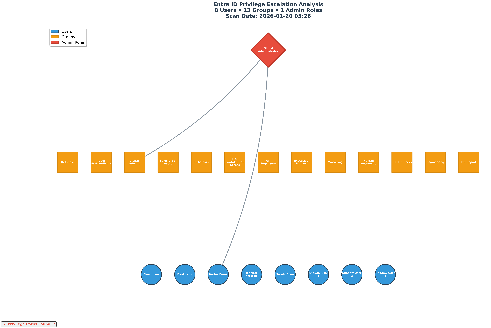

# Entra ID Attack Path Visualizer

**Automated detection and visualization of privilege escalation paths in Microsoft Entra ID (Azure AD)**



---

## Overview

The Entra ID Attack Path Visualizer scans your Microsoft Entra ID environment to detect privilege escalation paths through group memberships, role assignments, and nested permissions. It identifies users who have administrative access—both directly assigned and inherited through group chains.

### The Problem

Organizations often lose track of who has administrative privileges in Entra ID:
- **Shadow Admins**: Users gain admin access through nested group memberships
- **Role Sprawl**: Multiple entities assigned to privileged roles unnecessarily  
- **Audit Failures**: Manual reviews miss indirect privilege paths
- **Compliance Risks**: SOC 2, ISO 27001, and other frameworks require regular access reviews

**Manual review of hundreds of users and groups = 40+ hours of work**

**This tool automates it in 5 minutes.**

---

## What It Does

✅ **Scans Entra ID environment** via Microsoft Graph API  
✅ **Detects admin role assignments** (Global Admin, User Admin, Security Admin, etc.)  
✅ **Identifies privilege escalation paths** through group membership chains  
✅ **Generates visual graph** showing all privilege relationships  
✅ **Exports findings** to JSON for compliance documentation  

---

## Installation

### Prerequisites
- Python 3.10+
- Microsoft Entra ID tenant with admin access
- Microsoft Graph API permissions

### Setup
```bash
# Clone repository
git clone https://github.com/Dfrank77/entra-attack-path-visualizer.git
cd entra-attack-path-visualizer

# Create virtual environment
python3 -m venv venv
source venv/bin/activate  # On Windows: venv\Scripts\activate

# Install dependencies
pip install -r requirements.txt
```

---

## Usage

### Quick Start
```bash
# Activate virtual environment
source venv/bin/activate

# Run scanner
python src/entra_scanner.py

# Generate visualization
python src/visualizer.py
```

### What Happens

1. **Authentication**: Browser opens for Microsoft login (OAuth2)
2. **Scanning**: Tool reads users, groups, and role assignments via Microsoft Graph API
3. **Analysis**: Identifies admin access and privilege escalation paths
4. **Visualization**: Generates graph showing relationships
5. **Export**: Saves findings to `output/scan_results.json`

### Output Files
```
output/
├── scan_results.json       # Complete findings in JSON format
└── privilege_graph.png     # Visual graph (high-resolution)
```

---

## Technical Details

### Architecture

- **Scanner (`entra_scanner.py`)**: Connects to Microsoft Graph API, retrieves users/groups/roles
- **Analyzer**: Identifies admin role assignments and privilege paths
- **Visualizer (`visualizer.py`)**: Builds network graph using NetworkX, renders with Matplotlib

### Microsoft Graph API Permissions Required

- `User.Read.All` - Read all user profiles
- `Group.Read.All` - Read all group memberships
- `Directory.Read.All` - Read directory data
- `RoleManagement.Read.All` - Read role assignments

### Technology Stack

- **Microsoft Graph SDK** - Entra ID API access
- **NetworkX** - Graph analysis and privilege path detection
- **Matplotlib** - Visualization rendering
- **Azure Identity** - OAuth2 authentication

---

## Visual Guide

**The graph uses color-coded shapes:**

- 🔵 **Blue Circles** = Users
- 🟧 **Orange Squares** = Groups
- 🔴 **Red Diamonds** = Admin Roles (High Risk)
- ➡️ **Arrows** = Privilege escalation paths

**Reading the Graph:**
- Entities at the **TOP** = Highest privilege (Admin roles)
- Entities at the **BOTTOM** = Regular users
- **Follow arrows upward** to trace privilege escalation paths

---

## Business Value

### Time Savings
- **Manual access review**: 40+ hours per quarter
- **Automated scan**: 5 minutes
- **ROI**: 99% time reduction

### Compliance
- **SOC 2**: Automated quarterly access reviews
- **PCI-DSS**: Least privilege verification
- **ISO 27001**: Administrative access audit trail

### Security
- Identifies shadow administrators
- Detects privilege creep
- Prevents unauthorized access
- Provides audit evidence

---

## What This Project Demonstrates

**Identity & Access Management Expertise:**
- Deep understanding of Entra ID architecture
- Knowledge of privilege escalation attack vectors
- Experience with Microsoft Graph API
- Access review and compliance processes

**Security Engineering Skills:**
- Automated security analysis
- Risk assessment and prioritization
- Compliance documentation
- Security tool development

**Technical Capabilities:**
- Python development
- API integration (Microsoft Graph)
- Graph analysis and visualization
- Async programming patterns

---

## Use Cases

### SOC 2 Compliance
- Quarterly access reviews required
- Automated detection of excessive privileges
- Audit trail documentation

### Security Audits
- Identify shadow administrators
- Verify least privilege implementation
- Generate compliance reports

### Incident Response
- Quickly identify all users with admin access
- Trace privilege escalation paths
- Document access for forensics

---

## Future Enhancements

- [ ] Nested group membership analysis (multi-level)
- [ ] PIM (Privileged Identity Management) integration
- [ ] Conditional Access policy analysis
- [ ] Historical trend tracking
- [ ] Multi-tenant support
- [ ] Scheduled scans with alerting
- [ ] Export to CSV/Excel for reporting

---

## Author

**Darius Frank**  
IAM & Cloud Security Analyst

- **GitHub**: [@Dfrank77](https://github.com/Dfrank77)
- **LinkedIn**: [Darius Frank](https://linkedin.com/in/darius-frank-24a895192)
- **Portfolio**: [security-learning-artifacts](https://github.com/Dfrank77/security-learning-artifacts)

**Background:**
- 2 years hands-on IAM experience (Entra ID, AWS, Okta)
- Security+, Microsoft SC-300 certified
- Built parallel tool for AWS: [IAM Attack Path Visualizer](https://github.com/Dfrank77/iam-attack-path-visualizer)

*Demonstrating cross-platform IAM security expertise through automated privilege escalation detection.*

---

## License

MIT License - See [LICENSE](LICENSE) file for details

**Copyright © 2026 Darius Frank**

---

## Acknowledgments

Built with:
- Microsoft Graph SDK
- NetworkX (graph analysis)
- Matplotlib (visualization)
- Azure Identity (authentication)

Inspired by real-world IAM security challenges and the need for automated privilege escalation detection across cloud platforms.

---

**⚠️ Disclaimer**

This tool is intended for authorized security assessments and compliance audits only. Users must have appropriate permissions to scan their Entra ID environment. Unauthorized access to systems is illegal.
